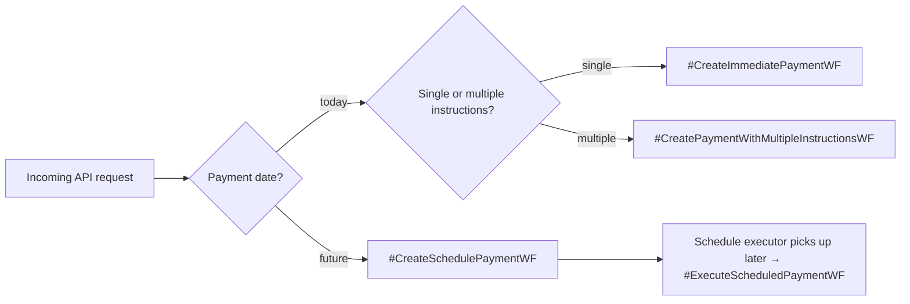
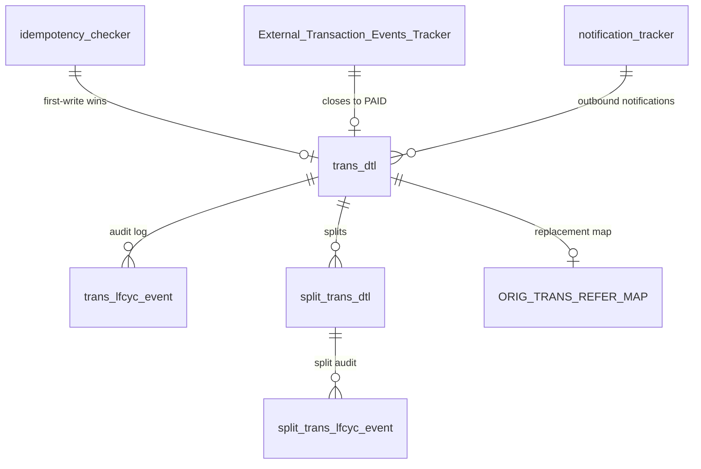

# Components in Detail

## One-Data Functions

These are the **public contracts** consumed by upstream systems. Each One-Data
function maps to one or more Billpay Core APIs.

| Function | Type | Maps to |
| --- | --- | --- |
| `CreatePayment.v3` | Core | `POST /payments` |
| `UpdatePayment.v1` | Core | `PUT /payments/{payment-id}` |
| `DeletePayment.v1` | Core | `DELETE /payments/{payment-id}` |
| `ReadPayments.v1` | Core | `GET /payments/account/{account-id}` |
| `ReadPaymentEventsById.v1` | Core | `GET /payments/{payment-id}` |
| `CreateCreditBalanceRefund.v1` | Core | `POST /refunds` |
| `CreatePaymentInstallment.v1` | Composite | `POST /paymentInstallments` (which fans out to Core) |

## Billpay Core APIs

| Method & Path | Purpose |
| --- | --- |
| `POST /payments` | Create an immediate or scheduled payment (single or multi-instruction) |
| `PUT /payments/{payment-id}` | Update an existing scheduled payment |
| `DELETE /payments/{payment-id}` | Cancel a scheduled or accepted payment |
| `POST /payments/returns` | Record a return (from Money Movement events) |
| `POST /payments/inbound` | Record an inbound payment from upstream |
| `POST /refunds` | Initiate a credit-balance refund |
| `GET /payments/account/{account-id}` | List payments for an account |
| `GET /payments/{payment-id}` | Read a single payment + lifecycle events |
| `POST /paymentInstallments` | Composite — create payment **and** installments together |

## Billpay Router

The router runs as part of the API layer and decides which workflow to invoke.

Routing inputs include `payment-date`, the **number of instructions**, the
account kind (`Consumer` vs `Corporate`), and the **clearing level**
(`Full` vs `Split`).

## Workers

- **Realtime Worker** runs workflows on the request path; the caller blocks
  until the workflow returns a deterministic outcome (`SCHEDULED`, `ACCEPTED`,
  `DECLINED`, etc).
- **Batch Worker** runs workflows triggered asynchronously — by Temporal
  Schedules, by event handlers, or by other workflows continuing as child
  workflows.

## External systems Billpay talks to

| System | Purpose |
| --- | --- |
| **Clearing** | Transmits the payment for inter-bank settlement |
| **Accounts Receivable (GAR)** | Decrements the cardholder's balance |
| **Authorization / OTB** | Increases open-to-buy when a payment is accepted |
| **Accounting** | Receives ledger entries on fulfillment |
| **Balance & Control** | Reconciles balances post-fulfillment |
| **Communications** | Sends notifications to the cardholder |
| **GPA (Allocations)** | For corporate payments — returns the split breakdown |

## Storage surface

