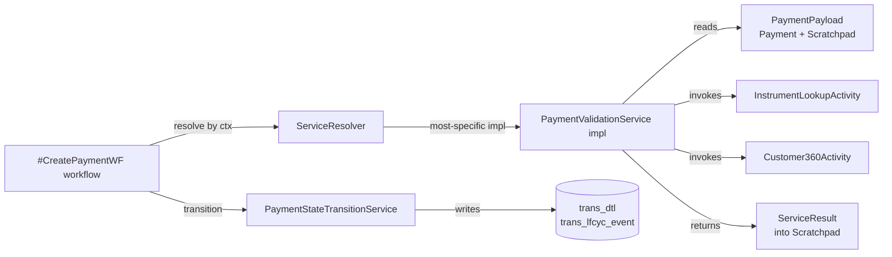

# Variant Resolution & Rule Engine — Proposal

:::caution[Status]
**Proposal — not yet adopted.** This group of pages describes a target architecture for how Payment Services should declare their variance, compose business rules, and exchange data across services. Implementation has not started. The existing principles page ([Build › Principles › Payment Services](../../principles/core-build/payment-services.md)) and the [Payment Services design reference](../../../design/services.md) remain canonical until this proposal is approved.
:::

## What this proposal solves

[`docs/design/services.md`](../../../design/services.md) lists 28 services. Most of them have **variants** — different implementations selected at runtime per **market**, **account-type**, **source**, and **frequency**. The existing principles page names the problem ("`ServiceResolver` selects the right implementation at runtime") but does not prescribe **how** that resolver works, **how** implementations declare their variance, **how** business rules inside a service are organised, or **how** services exchange data without bleeding into the hardened domain model.

This proposal answers those four questions in one coherent shape.

## The four ideas

1. **Variants are declarative.** Each service interface lists its variance axes with `@VariesOn(...)`. Each implementation declares its tuple with `@PaymentVariant(...)`. A **KSP** processor generates a per-interface index at build time. Conflicts fail the build, not the first request in production.

2. **Resolution is specificity-based with hierarchical fallback.** `(UK, Consumer, Autopay, Recurring)` beats `(UK, Consumer)` beats `(UK)` beats generic. A bit-weighted score (source=8, frequency=4, accountType=2, market=1) gives a unique total ordering — no tie-breaker needed.

3. **Service logic is a rulebook, not an `if`-chain.** Each business check (instrument valid, amount in range, mandate valid, customer360 correct, clearing-date future, …) is an atomic `ValidationRule` bean. Variants compose them via a type-safe `rulebook { … }` DSL. One generic `RuleBasedPaymentValidationService` reads the rulebook for the context and walks it. Custom impls remain available as an escape hatch.

4. **The hardened Domain Model is separate from the workflow scratchpad.** The `Payment` domain model transitions through states the way it always has — via `PaymentStateTransitionService` writing to `trans_dtl` / `trans_lfcyc_event`. Intermediate service outputs (allocations snapshot ids, risk scores, OTB headroom) live in a `WorkflowScratchpad` that is **never persisted** and **never folded into the Payment**. Services receive `PaymentPayload(payment, scratchpad)`; the type system prevents accidentally folding workflow-only data into the domain.

## Request flow at a glance

The workflow holds the resolver, picks the impl by context, threads a `PaymentPayload` through every call, and writes domain changes only through `PaymentStateTransitionService`.

## Read in this order

1. [**Interfaces**](./interfaces.md) — how to declare a service interface, an implementation, the module layout, and the new-impl checklist.
2. [**Strategies**](./strategies.md) — how routing happens at runtime, the specificity score, the worked `PaymentValidationService` example.
3. [**Data Flow**](./data-flow.md) — Domain Model vs `WorkflowScratchpad`, `PaymentPayload`, `@OrchestrationPlan`, the `OrchestrationLint` build check.
4. [**Variant Resolution**](./variant-resolution.md) — deep technical reference for the KSP processor and the resolver; recommended and incremental tooling paths.
5. [**Rule Engine**](./rule-engine.md) — rules, rulebooks, the DSL, three side-by-side impl variations of `PaymentValidationService`, and the catalogue of common rules.
6. [**Tooling Rationale**](./tooling-rationale.md) — per-tool justification: alternatives considered, reasons rejected, why this pick. (Kotlin and Quarkus are project defaults and not re-justified.)

## Scope guardrails

- **Documentation only.** No code lands with this proposal.
- The existing [Payment Services principles](../../principles/core-build/payment-services.md) page and the [services design reference](../../../design/services.md) are **not modified** by this proposal.
- Variant axes documented today: **market**, **account-type**, **source**, **frequency**. The mechanism extends to more axes without rework, but only these four are committed.
