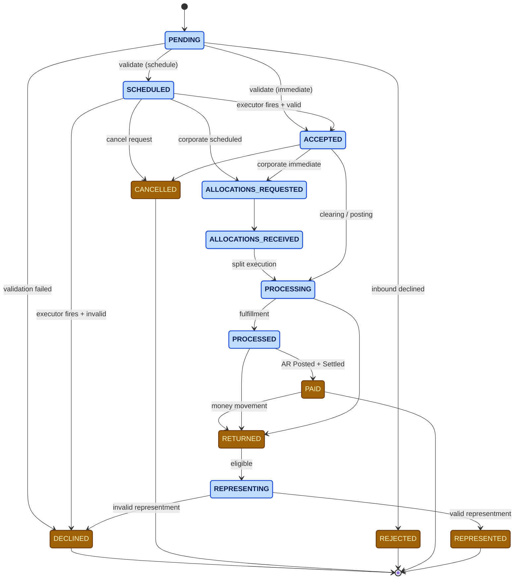

# The Payment State Model

Every payment in Billpay travels through a state machine. The same machine
serves both payment-level (`trans_dtl`) and split-level
(`split_trans_dtl`) records.

## The states

States are colour-coded by **lifecycle position only** — *non-terminal* (the payment is still moving) versus *terminal* (the payment is settled into a final state and will not transition further).

| State | Meaning | Terminal? |
| --- | --- | --- |
| PENDING | Request accepted into Billpay; idempotency row written | No |
| SCHEDULED | Validated for a future-dated payment; waiting for the executor | No |
| ALLOCATIONS_REQUESTED | Corporate payment — GPA asked for allocation breakdown | No |
| ALLOCATIONS_RECEIVED | GPA returned allocations; ready to execute splits | No |
| ACCEPTED | Validated for execution today | No |
| PROCESSING | Sent to Clearing / Posting; awaiting fulfillment | No |
| PROCESSED | Internally fulfilled (Accounting / B&C / Comms notified) | No |
| REPRESENTING | Retry transaction created after a return | No |
| PAID | AR posted **and** Clearing settled — closed out | **Yes** |
| RETURNED | Money came back from clearing | **Yes** |
| REPRESENTED | Representment cleared successfully | **Yes** |
| DECLINED | Validation failed (either at scheduling or at execution) | **Yes** |
| CANCELLED | Cancelled before reaching `PROCESSING` | **Yes** |
| REJECTED | Inbound payment declined and rejected back | **Yes** |

## The big picture

:::info[Corporate flow nuance]
- **Corporate scheduled** → `SCHEDULED` → `ALLOCATIONS_REQUESTED` → `ALLOCATIONS_RECEIVED` → execution
- **Corporate immediate** → `ACCEPTED` → `ALLOCATIONS_REQUESTED` → `ALLOCATIONS_RECEIVED` → execution

In both cases the splits are then executed by `#ExecuteSplitPaymentWF` (on the Batch worker for Corporate).
:::

## Lifecycle events

Every state transition emits a **lifecycle event** that is:

1. Appended to `trans_lfcyc_event` (or `split_trans_lfcyc_event` for splits)
2. Published on the lifecycle event topic for downstream subscribers

The contract is enforced by `PaymentStateTransitionService` /
`PaymentSplitStateTransitionService`, which always run **alongside** the
service that triggers the transition.

For the per-workflow state-diagram view, see
[State Diagrams](diagrams/state-diagram.md).
