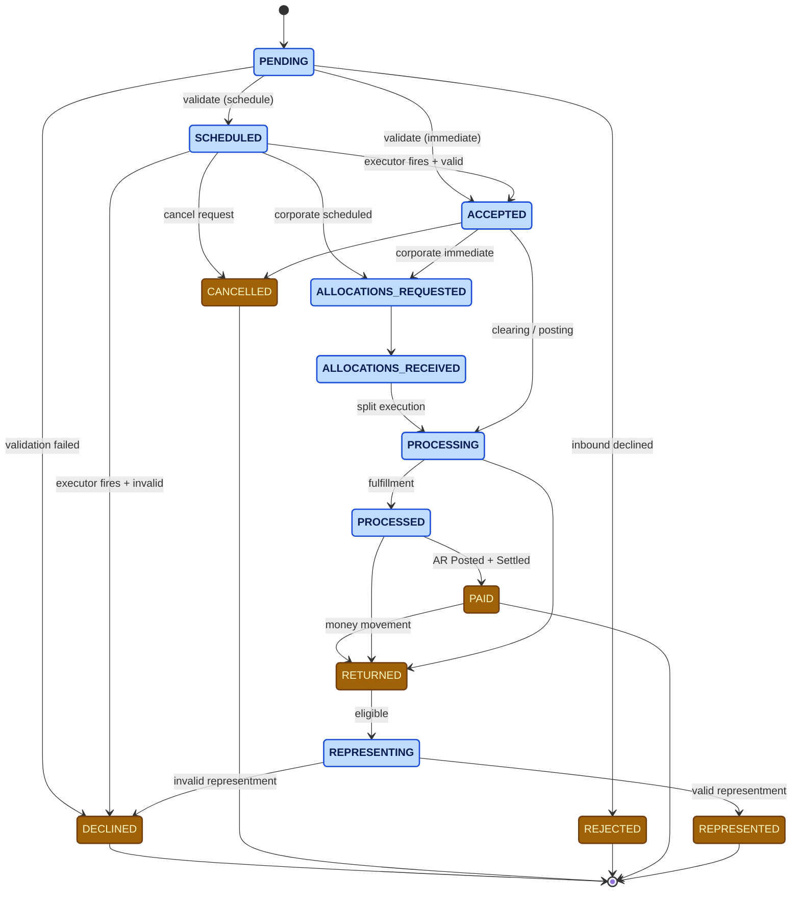

# The Payment State Model

Every payment in Billpay travels through a state machine. The same machine
serves both payment-level (`trans_dtl`) and split-level
(`split_trans_dtl`) records.

## The states

States are colour-coded by **lifecycle position only** — *non-terminal* (the payment is still moving) versus *terminal* (the payment is settled into a final state and will not transition further).

| State | Meaning | Terminal? |
| --- | --- | --- |
| PENDING | The payment has been received and is awaiting initial processing. | No |
| SCHEDULED | The payment is set to execute at a future date. | No |
| ALLOCATIONS_REQUESTED | The payment is awaiting its allocation breakdown. | No |
| ALLOCATIONS_RECEIVED | The payment's allocation breakdown is available. | No |
| ACCEPTED | The payment is approved and ready to execute. | No |
| PROCESSING | The payment is currently being executed. | No |
| PROCESSED | The payment has been executed by Billpay; downstream confirmation is outstanding. | No |
| REPRESENTING | The payment is being re-attempted. | No |
| PAID | The payment is fully settled. | **Yes** |
| RETURNED | The payment did not settle; funds were returned. | **Yes** |
| REPRESENTED | The re-attempted payment is fully settled. | **Yes** |
| DECLINED | The payment was not approved for execution. | **Yes** |
| CANCELLED | The payment was withdrawn before completion. | **Yes** |
| REJECTED | The payment was not accepted into Billpay. | **Yes** |

## The big picture

:::info[Corporate flow nuance]
- **Corporate scheduled** → `SCHEDULED` → `ALLOCATIONS_REQUESTED` → `ALLOCATIONS_RECEIVED` → execution
- **Corporate immediate** → `ACCEPTED` → `ALLOCATIONS_REQUESTED` → `ALLOCATIONS_RECEIVED` → execution

In both cases the splits are then executed by `#ExecuteSplitPaymentWF` (on the Batch worker for Corporate).
:::

## Lifecycle events

Every state transition emits a **lifecycle event** that is:

1. Appended to `trans_lfcyc_event` (or `split_trans_lfcyc_event` for splits)
2. Published on the lifecycle event topic for downstream subscribers

The contract is enforced by `PaymentStateTransitionService` /
`PaymentSplitStateTransitionService`, which always run **alongside** the
service that triggers the transition.

For the per-workflow state-diagram view, see
[State Diagrams](diagrams/state-diagram.md).
