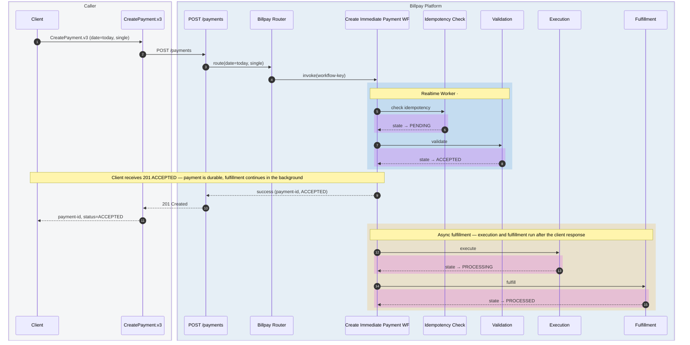
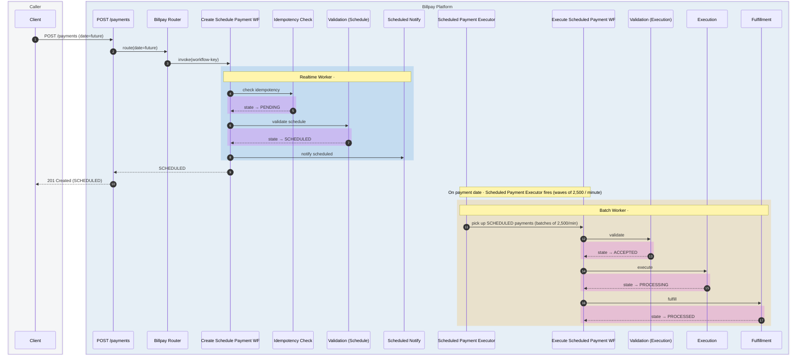
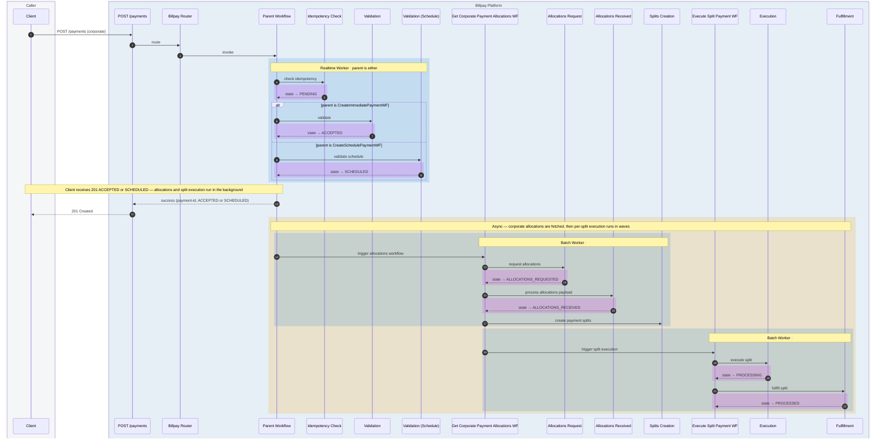
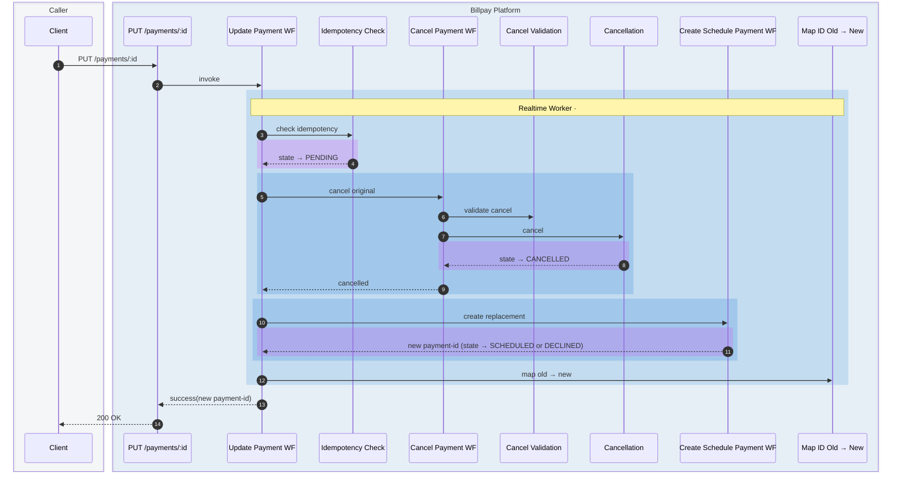
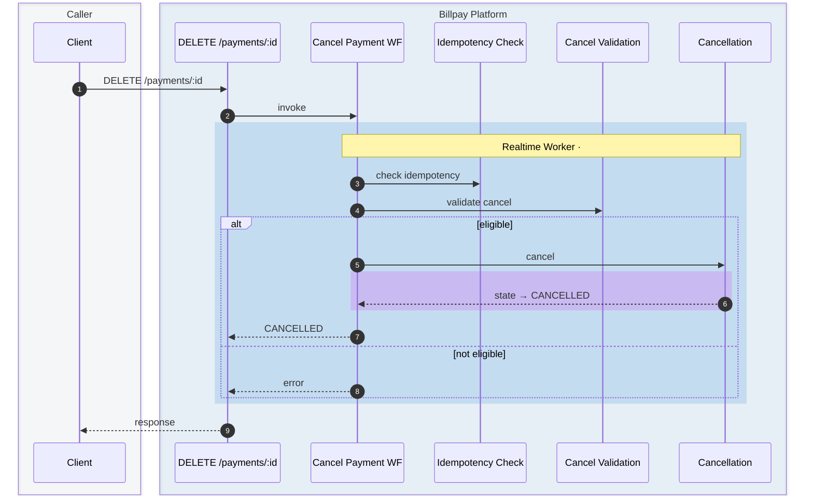
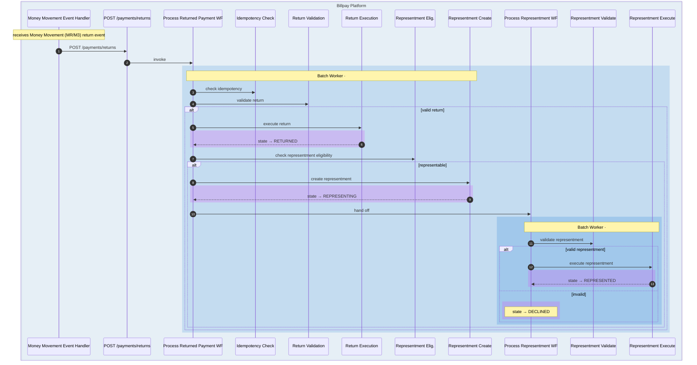
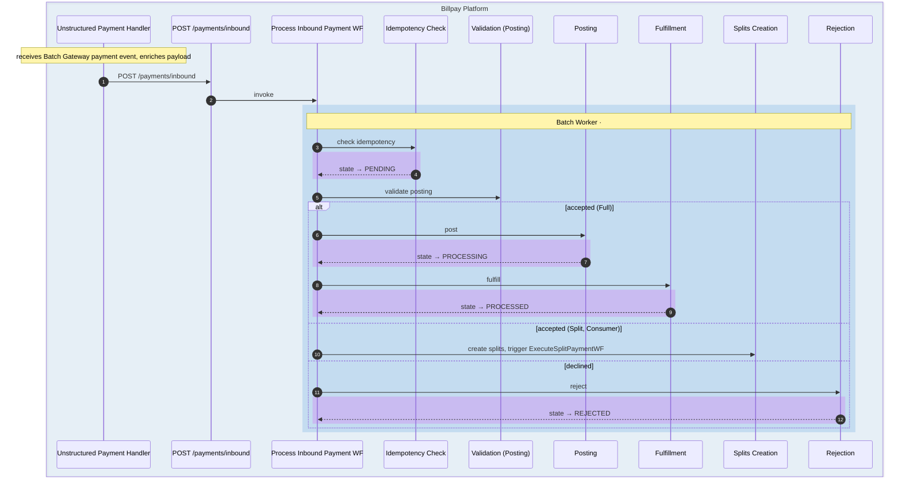
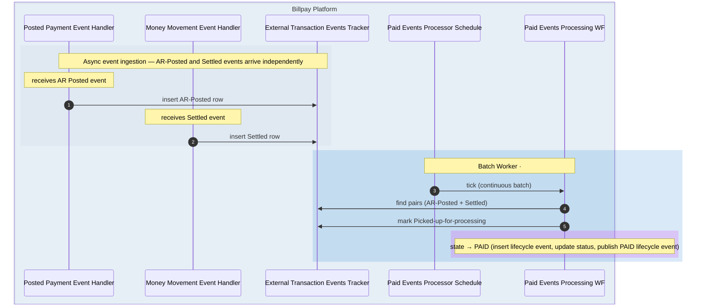
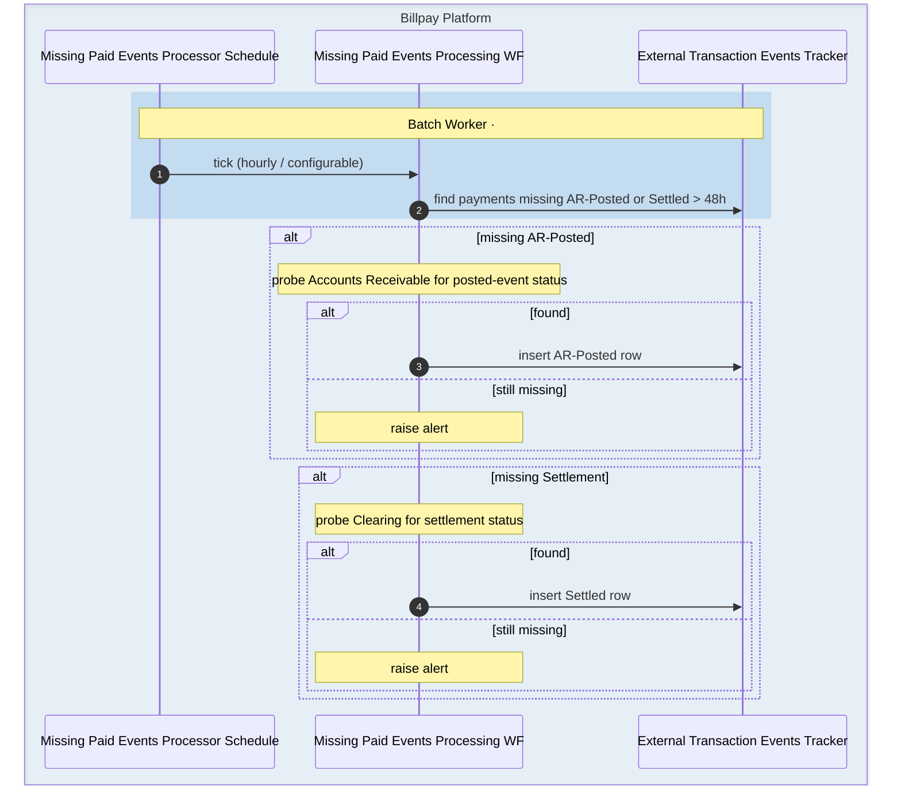
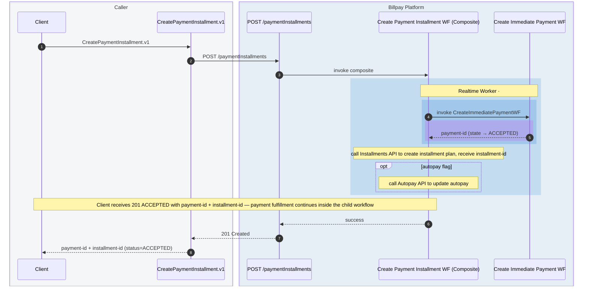

# Sequence Diagrams

End-to-end traces from a caller's perspective. Each diagram covers a complete
Billpay flow — **One-Data function → Core API → Router → Workflows →
Payment Services**.

Most diagrams show two groups at the top:

- **Caller** — the caller side (soft slate)
- **Billpay Platform** — everything past the contract: Core API, Router, Workflows, and named Payment Services (light blue)

Internal reconciliation flows (event handlers + schedules) show only the Billpay Platform group.

Inside the body:

- **Blue-tinted rectangles** wrap the messages that belong to a single workflow (the workflow name is labeled at the top of the block).
- **Amber-tinted rectangles** mark async work that happens *after* the client has been responded to.
- **Fuchsia/pink-tinted rectangles** pop out **state transitions** — moments where the payment moves from one lifecycle state to another (`PENDING → ACCEPTED`, `PROCESSING → PROCESSED`, etc.).

Each Payment Service appears as its **own participant**. To keep diagrams readable, the participant label drops the redundant `Payment` prefix and `Service` suffix — e.g., `Execution` represents `PaymentExecutionService`, `Idempotency Check` covers both `NewPaymentIdempotencyService` and `ExistingPaymentIdempotencyService`. External systems and infrastructure (clearing, AR, OTB, accounting, database, event bus) are intentionally omitted — they're internal implementation details of the services that own them.

## 1. Immediate payment — single instruction

`CreatePayment.v3` → `POST /payments` (today, single instruction) →
`#CreateImmediatePaymentWF`.

## 2. Scheduled payment — created today, executed later

`CreatePayment.v3` → `POST /payments` (future date) →
`#CreateSchedulePaymentWF` → later → `#ExecuteScheduledPaymentWF`.

:::note[After PROCESSED]
`PAID` is reached separately by the **Paid Events Processor reconciliation** — see [diagram #8](#8-paid-events-reconciliation).
:::

## 3. Corporate payment with allocations

## 4. Update a scheduled payment

## 5. Cancel a payment

## 6. Return processing (with representment branch)

## 7. Inbound payment

## 8. Paid Events reconciliation

## 9. Missing Paid Events reconciliation

## 10. Create Payment + Installments (composite)

