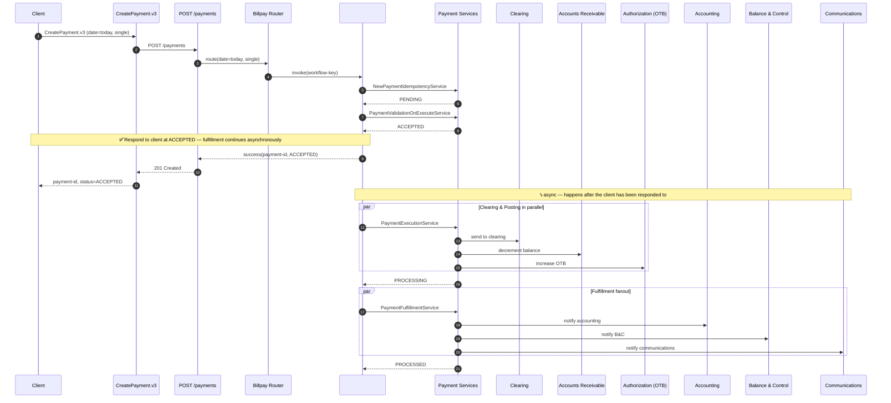
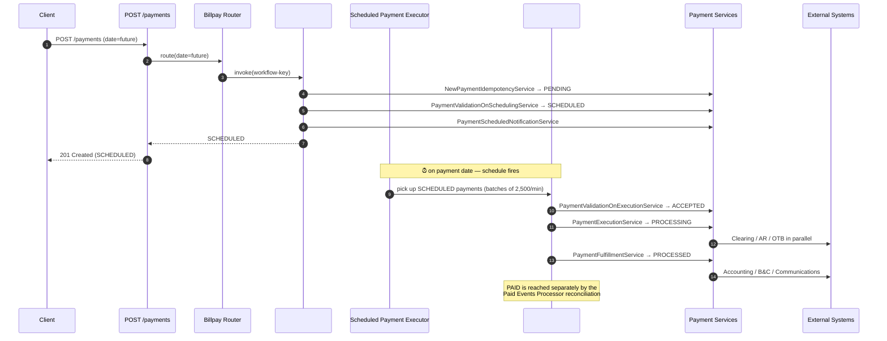
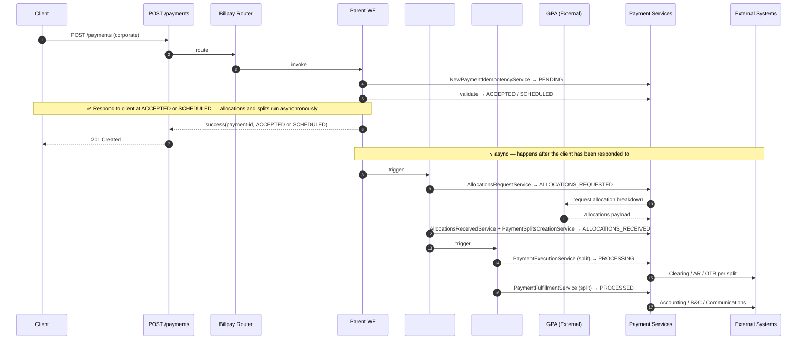
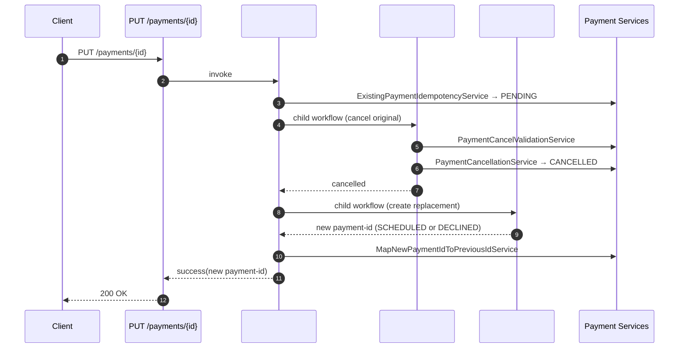
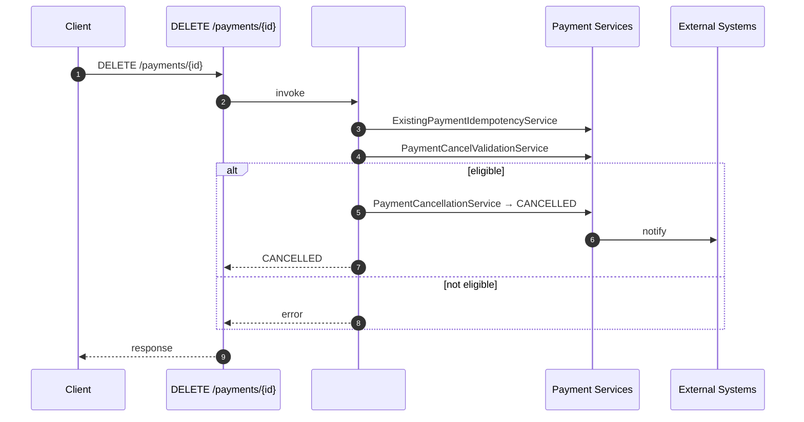
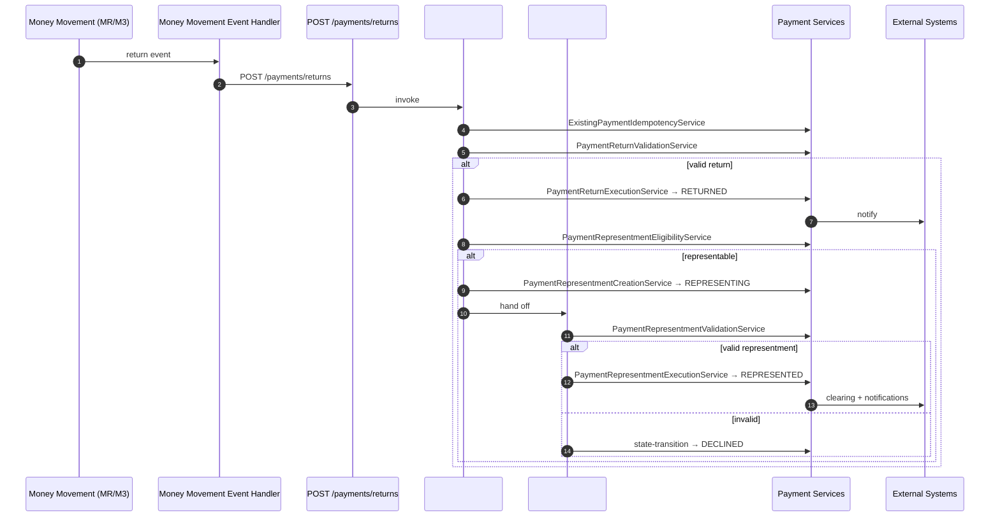
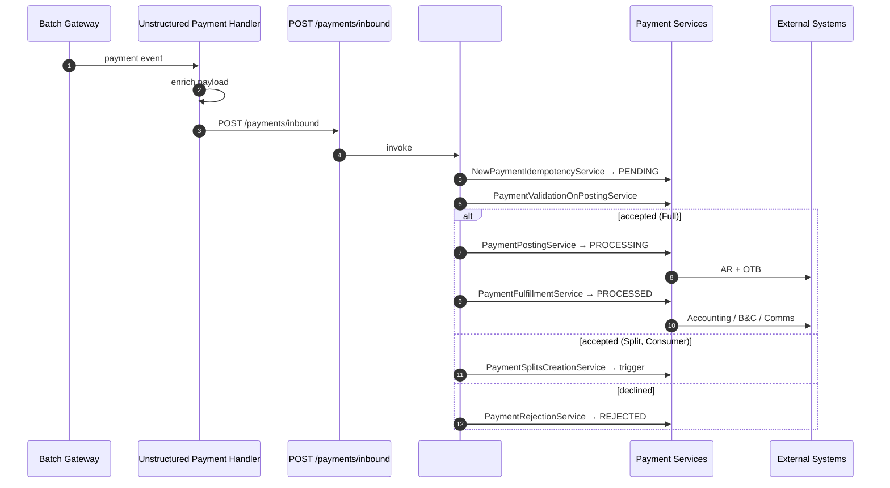
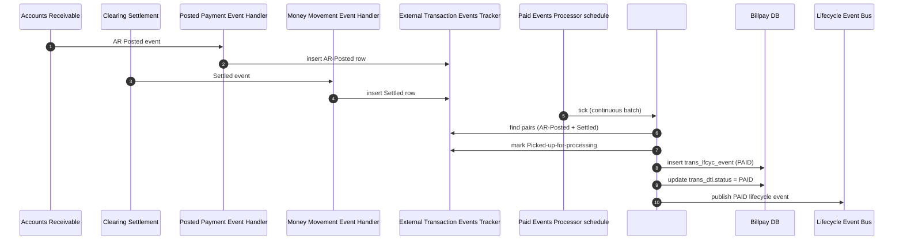
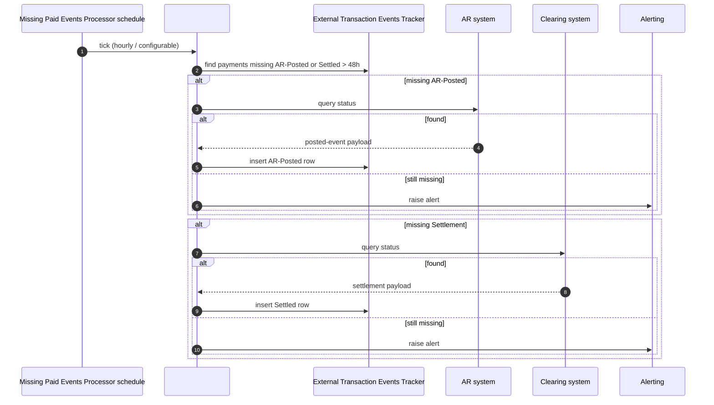
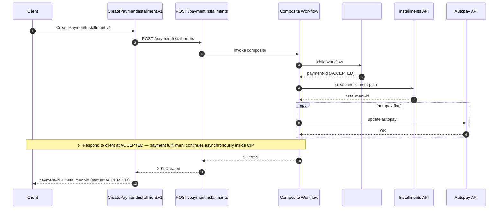

# Sequence Diagrams

End-to-end traces from a caller's perspective. Each diagram covers a complete
Billpay flow — **One-Data function → Core API → Router → Workflows →
Services → External systems**.

## 1. Immediate payment — single instruction

`CreatePayment.v3` → `POST /payments` (today, single instruction) →
`#CreateImmediatePaymentWF`.

## 2. Scheduled payment — created today, executed later

`CreatePayment.v3` → `POST /payments` (future date) →
`#CreateSchedulePaymentWF` → later → `#ExecuteScheduledPaymentWF`.

## 3. Corporate payment with allocations

## 4. Update a scheduled payment

## 5. Cancel a payment

## 6. Return processing (with representment branch)

## 7. Inbound payment

## 8. Paid Events reconciliation

## 9. Missing Paid Events reconciliation

## 10. Create Payment + Installments (composite)

