# State Diagrams

One state diagram per workflow. Each diagram captures every transition the
workflow can perform and which **Payment Service(s)** drive it.

For a single, combined view of the full state model, see
[The Payment State Model](../architecture/state-model.md).

## 1. `#CreateImmediatePaymentWF`

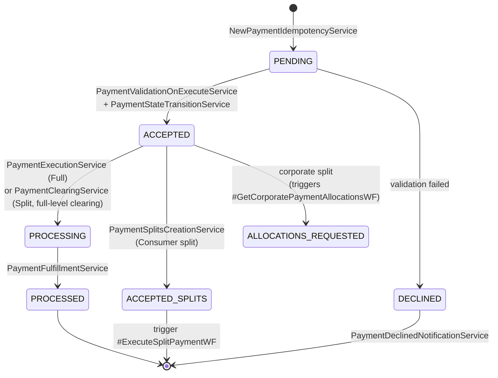

## 2. `#CreateSchedulePaymentWF`

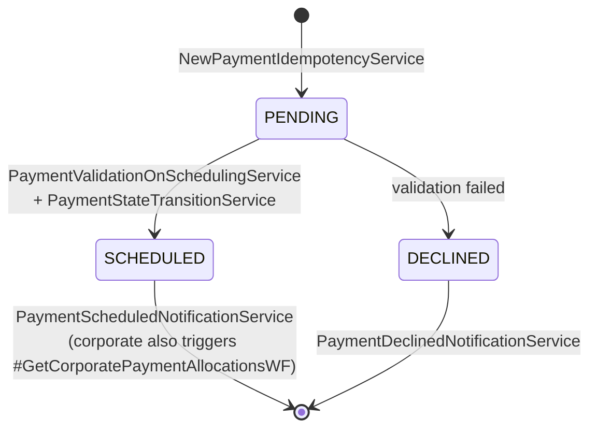

## 3. `#ExecuteScheduledPaymentWF`

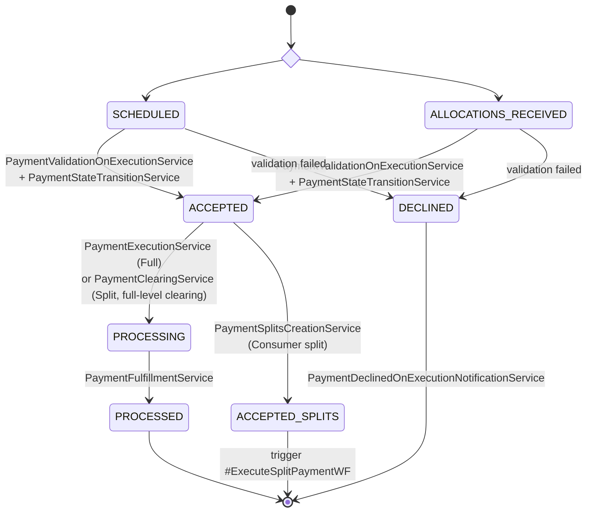

## 4. `#ExecuteSplitPaymentWF`

Operates at **split level** on `split_trans_dtl`.

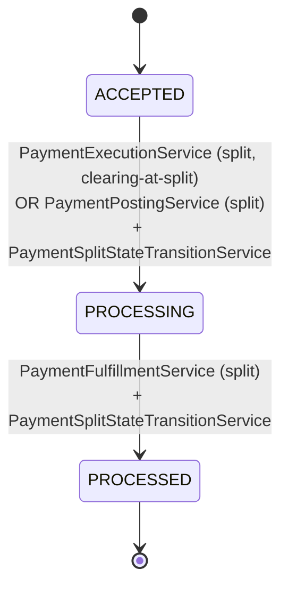

## 5. `#CancelPaymentWF`

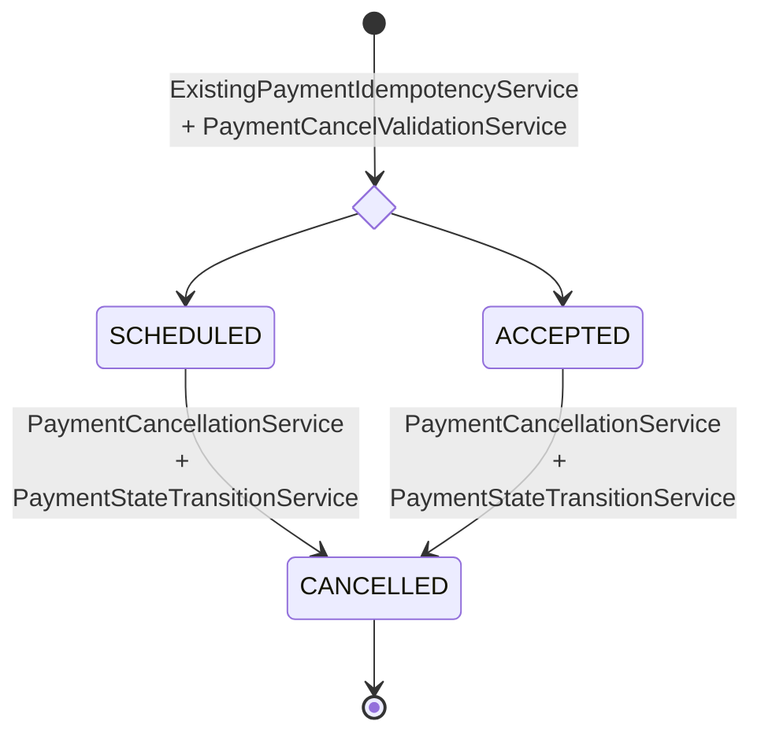

## 6. `#UpdatePaymentWF`

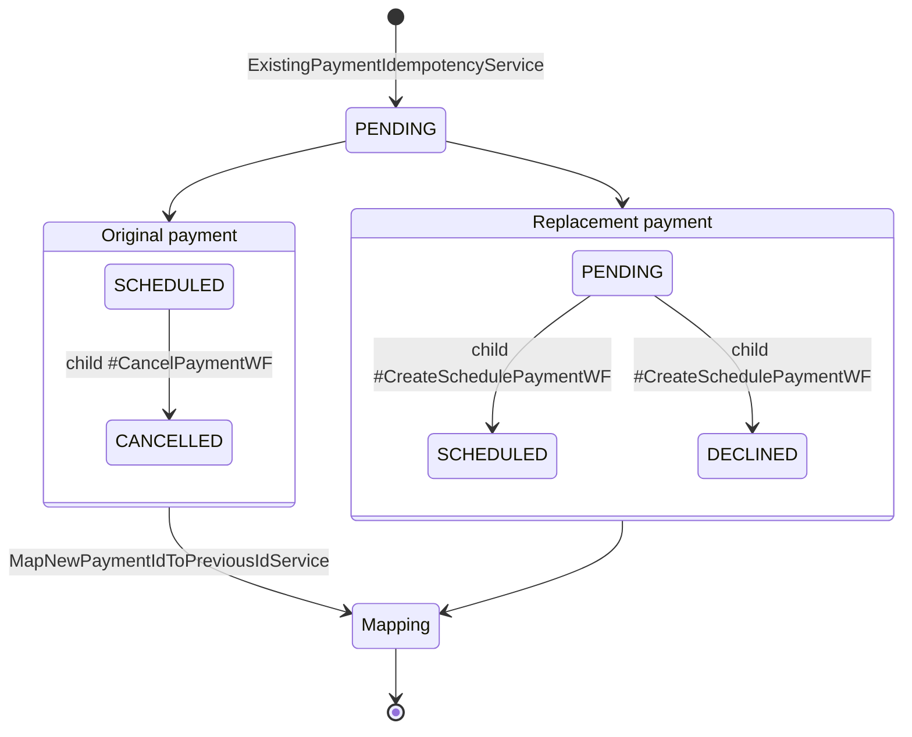

## 7. `#ProcessReturnedPaymentWF`

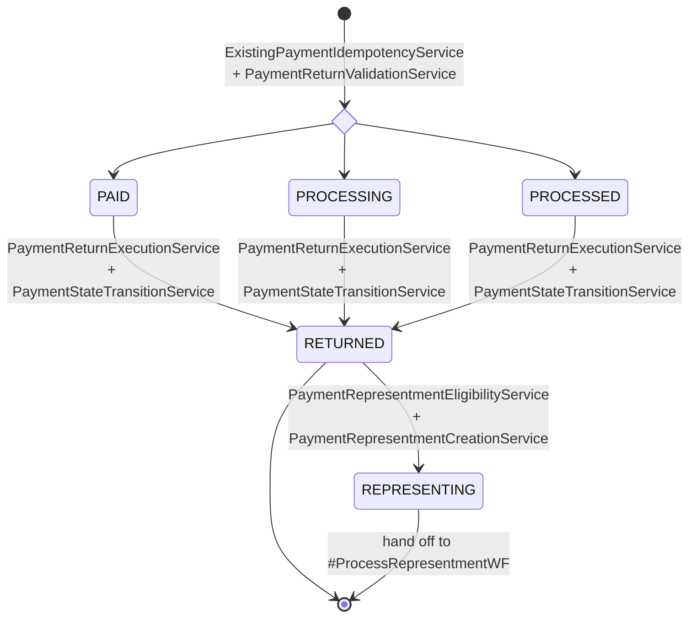

## 8. `#ProcessRepresentmentWF`

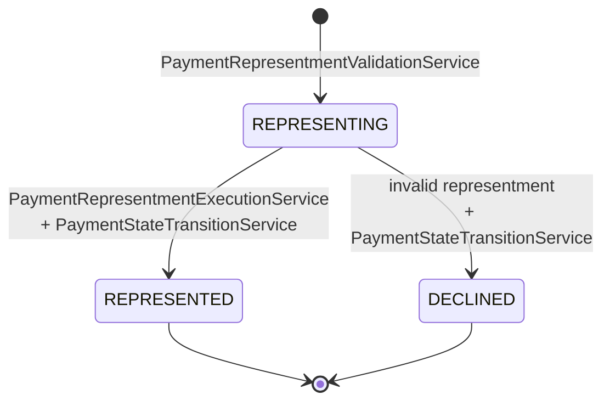

## 9. `#GetCorporatePaymentAllocationsWF`

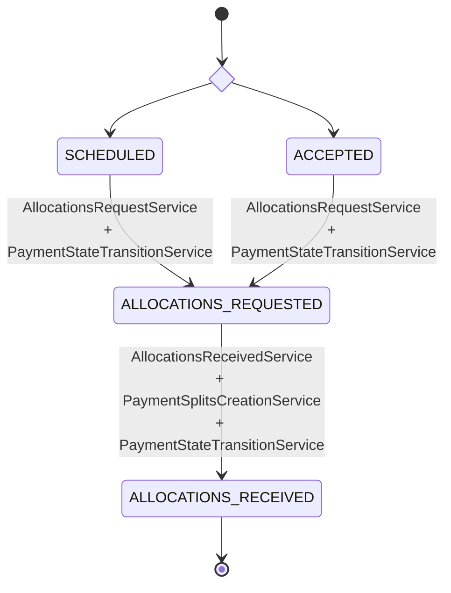

## 10. `#ProcessInboundPaymentWF`

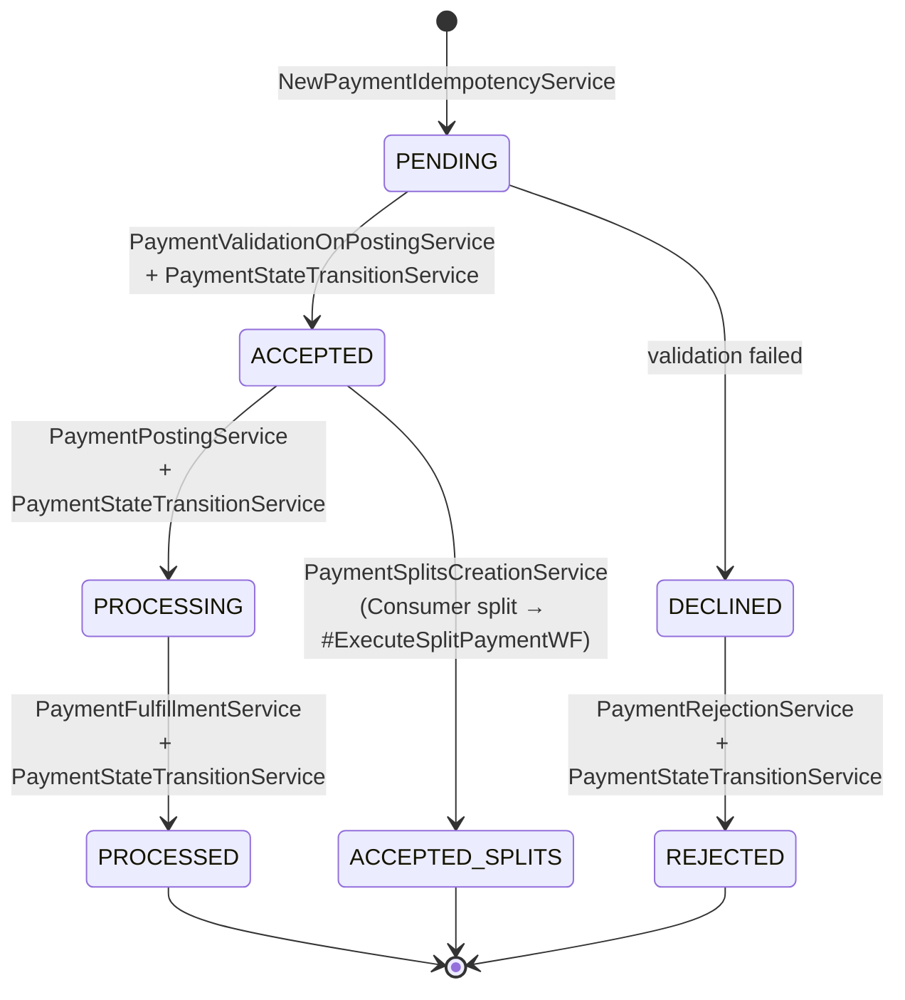

## 11. `#CreateBalanceRefundWF`

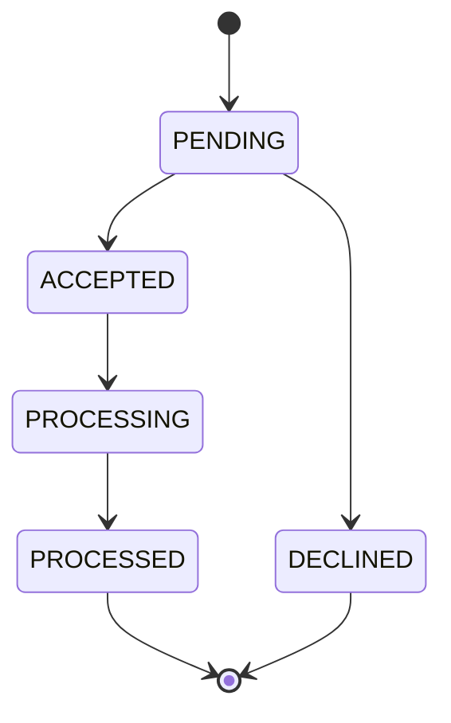
