# State Diagrams

One state diagram per workflow. Each diagram captures every transition the
workflow can perform and which **Payment Service(s)** drive it.

For a single, combined view of the full state model, see
[The Payment State Model](../architecture/state-model.md).

## 1. `#CreateImmediatePaymentWF`

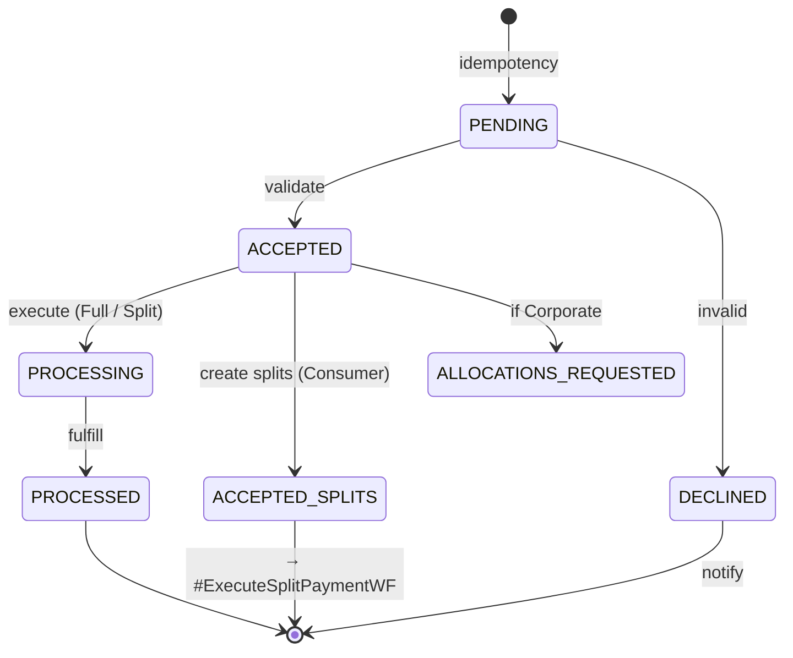

:::note[Service mapping]
- **idempotency** → `NewPaymentIdempotencyService`
- **validate** → `PaymentValidationService` + `PaymentStateTransitionService`
- **execute (Full / Split)** → `PaymentExecutionService` *(Full)* or `PaymentClearingService` *(Split, full-level clearing)*
- **fulfill** → `PaymentFulfillmentService`
- **create splits (Consumer)** → `PaymentSplitsCreationService`
- **if Corporate** → triggers `#GetCorporatePaymentAllocationsWF`
- **notify** (DECLINED) → `PaymentDeclinedNotificationService`
:::

## 2. `#CreateSchedulePaymentWF`

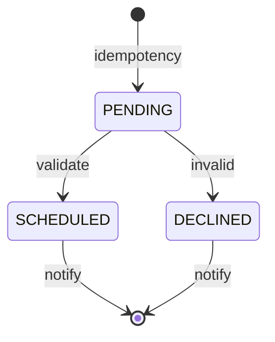

:::note[Service mapping]
- **idempotency** → `NewPaymentIdempotencyService`
- **validate** → `PaymentValidationOnSchedulingService` + `PaymentStateTransitionService`
- **notify** (SCHEDULED) → `PaymentScheduledNotificationService` *(Corporate additionally triggers `#GetCorporatePaymentAllocationsWF`)*
- **notify** (DECLINED) → `PaymentDeclinedNotificationService`
:::

## 3. `#ExecuteScheduledPaymentWF`

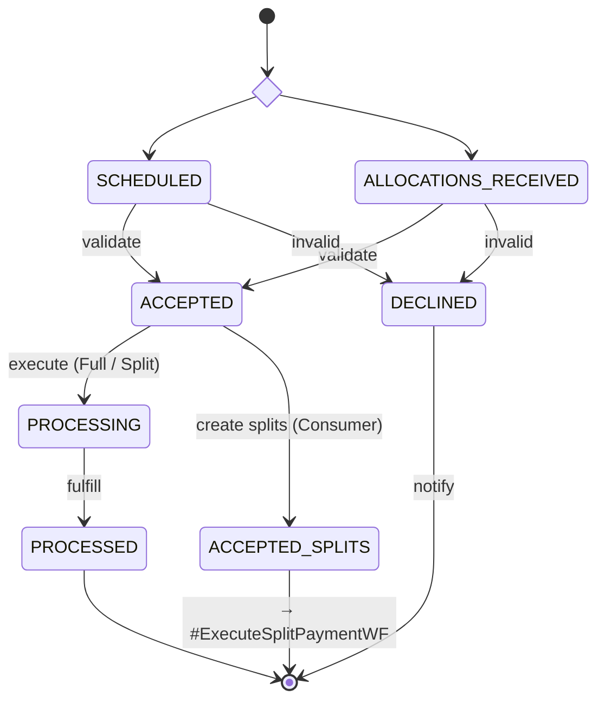

:::note[Service mapping]
- **validate** → `PaymentValidationOnExecutionService` + `PaymentStateTransitionService`
- **execute (Full / Split)** → `PaymentExecutionService` *(Full)* or `PaymentClearingService` *(Split, full-level clearing)*
- **fulfill** → `PaymentFulfillmentService`
- **create splits (Consumer)** → `PaymentSplitsCreationService`
- **notify** (DECLINED) → `PaymentDeclinedOnExecutionNotificationService`
:::

## 4. `#ExecuteSplitPaymentWF`

Operates at **split level** on `split_trans_dtl`.

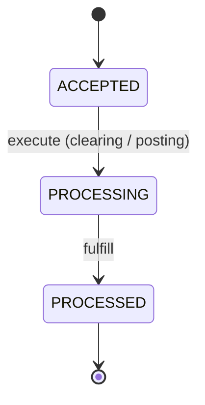

:::note[Service mapping]
- **execute (clearing / posting)** → `PaymentExecutionService` *(split, clearing-at-split)* **or** `PaymentPostingService` *(split)*, both paired with `PaymentSplitStateTransitionService`
- **fulfill** → `PaymentFulfillmentService` *(split)* + `PaymentSplitStateTransitionService`
:::

## 5. `#CancelPaymentWF`

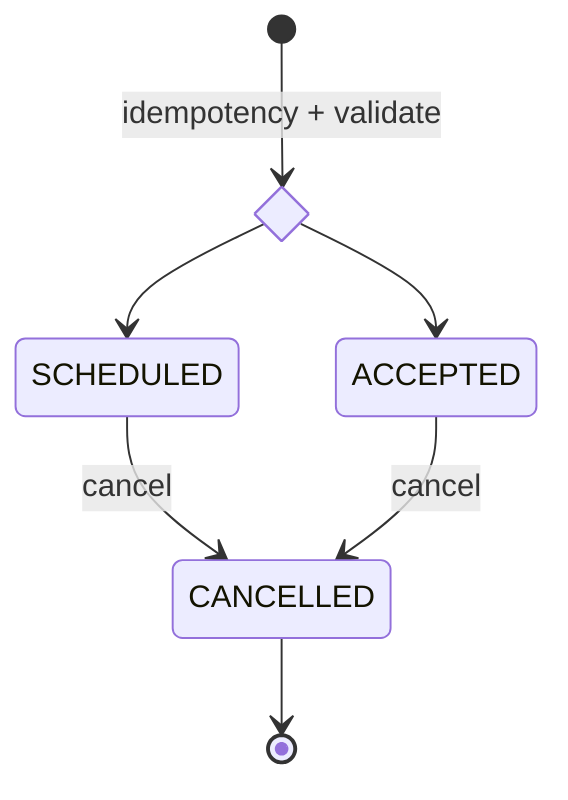

:::note[Service mapping]
- **idempotency + validate** → `ExistingPaymentIdempotencyService` + `PaymentCancelValidationService`
- **cancel** → `PaymentCancellationService` + `PaymentStateTransitionService`
:::

## 6. `#UpdatePaymentWF`

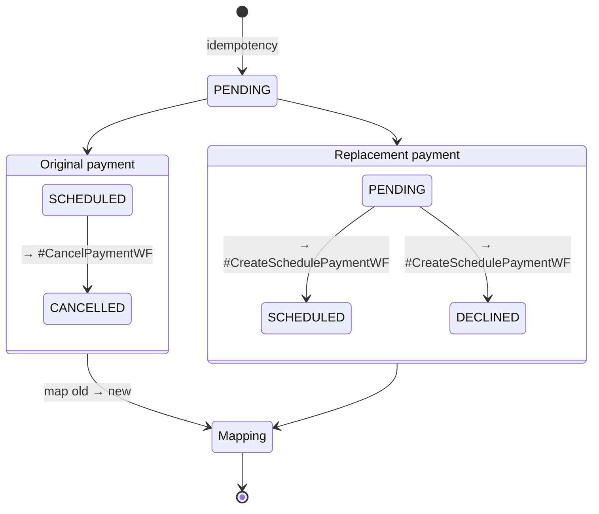

:::note[Service mapping]
- **idempotency** → `ExistingPaymentIdempotencyService`
- **→ #CancelPaymentWF / → #CreateSchedulePaymentWF** → child workflows
- **map old → new** → `MapNewPaymentIdToPreviousIdService` *(records the relationship in `ORIG_TRANS_REFER_MAP`)*
:::

## 7. `#ProcessReturnedPaymentWF`

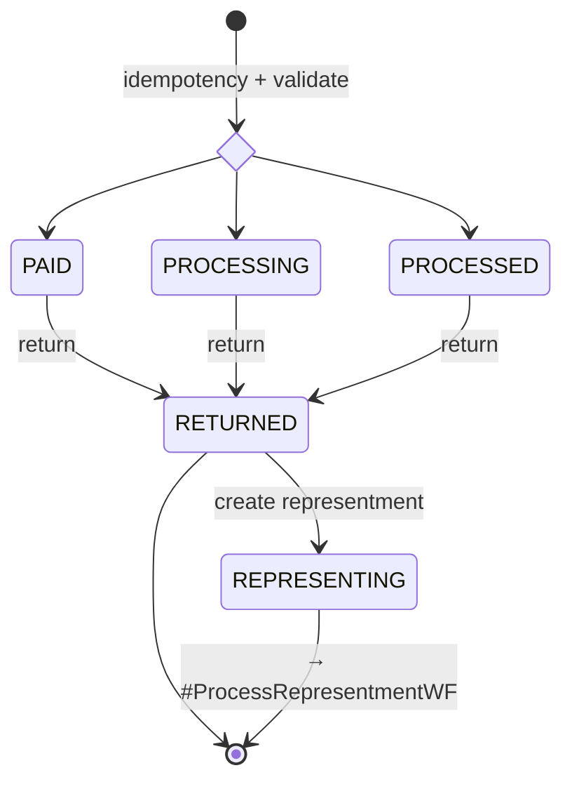

:::note[Service mapping]
- **idempotency + validate** → `ExistingPaymentIdempotencyService` + `PaymentReturnValidationService`
- **return** → `PaymentReturnExecutionService` + `PaymentStateTransitionService`
- **create representment** → `PaymentRepresentmentEligibilityService` + `PaymentRepresentmentCreationService`
:::

## 8. `#ProcessRepresentmentWF`

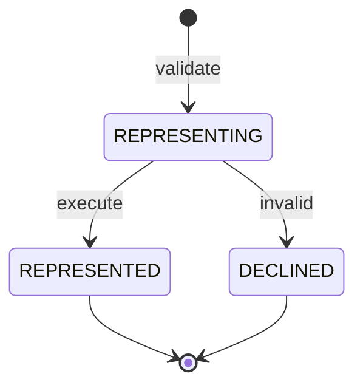

:::note[Service mapping]
- **validate** → `PaymentRepresentmentValidationService`
- **execute** → `PaymentRepresentmentExecutionService` + `PaymentStateTransitionService`
- **invalid** → state transition only via `PaymentStateTransitionService`
:::

## 9. `#GetCorporatePaymentAllocationsWF`

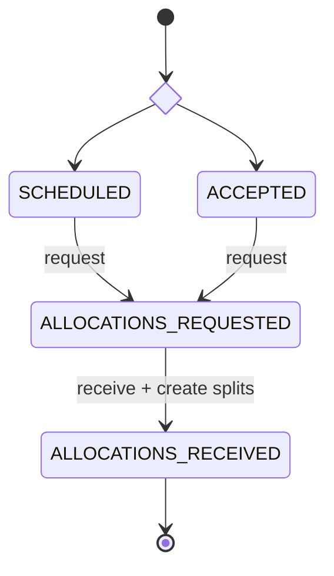

:::note[Service mapping]
- **request** → `AllocationsRequestService` + `PaymentStateTransitionService`
- **receive + create splits** → `AllocationsReceivedService` + `PaymentSplitsCreationService` + `PaymentStateTransitionService`
:::

## 10. `#ProcessInboundPaymentWF`

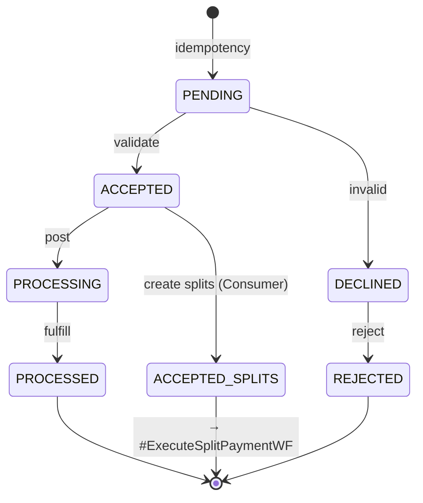

:::note[Service mapping]
- **idempotency** → `NewPaymentIdempotencyService`
- **validate** → `PaymentValidationOnPostingService` + `PaymentStateTransitionService`
- **post** → `PaymentPostingService` + `PaymentStateTransitionService`
- **fulfill** → `PaymentFulfillmentService` + `PaymentStateTransitionService`
- **create splits (Consumer)** → `PaymentSplitsCreationService`
- **reject** → `PaymentRejectionService` + `PaymentStateTransitionService`
:::

## 11. `#CreateBalanceRefundWF`

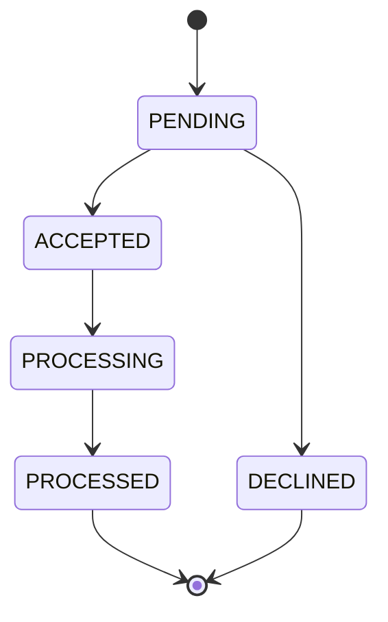
